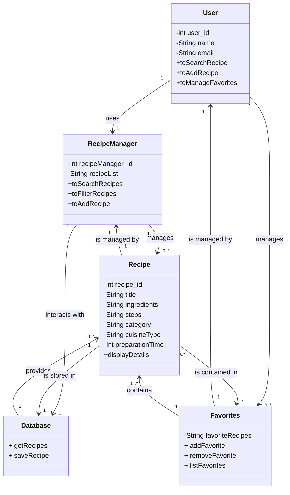

# Diagrammes de classes

Représentation des classes de l'application MediaLibrary.

```mermaid

classDiagram
    class User {
        -int user_id
        -String name
        -String email
        +toSearchRecipe
        +toAddRecipe
        +toManageFavorites
    }

    class Recipe {
        -int recipe_id
        -String title
        -String ingredients
        -String steps
        -String category
        -String cuisineType
        -Int preparationTime
        +displayDetails
    }

    class RecipeManager {
        -int recipeManager_id
        -String recipeList
        +toSearchRecipes
        +toFilterRecipes
        +toAddRecipe

    }

    class Favorites {
    -String favoriteRecipes
    + addFavorite
    + removeFavorite
    + listFavorites
}

class Database {
    + getRecipes
    + saveRecipe
}

User "1" --> "1" RecipeManager : uses
RecipeManager "1" --> "0..*" Recipe : manages
Recipe "1" --> "1" RecipeManager : is managed by

RecipeManager "1" --> "1" Database : interacts with
Database "1" --> "0..*" Recipe : provides
Recipe "1" --> "1" Database : is stored in

User "1" --> "0..*" Favorites : manages
Favorites "1" --> "1" User : is managed by

Favorites "1" --> "0..*" Recipe : contains
Recipe "0..*" --> "1" Favorites : is contained in

```