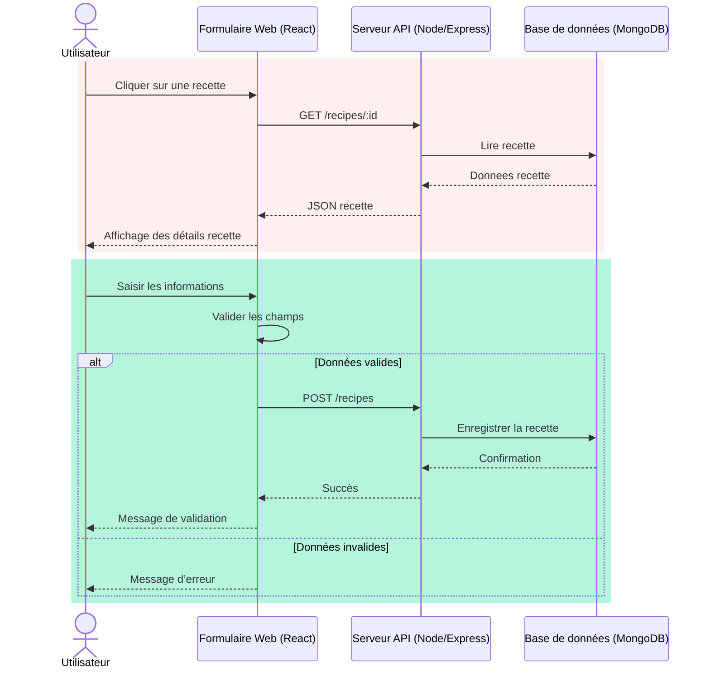

# Diagrammes de séquences
Représentation des séquences de l'application Recipes.

## Les actions des utilisateurs

```mermaid

sequenceDiagram
    actor Utilisateur
    participant Front as Interface Web (React)
    participant API as Serveur API
    participant DB as Base de donnees

    rect rgb(255,240,240) 
        Utilisateur->>Front: Cliquer sur une recette
        Front->>API: GET /recipes/:id
        API->>DB: Lire recette
        DB-->>API: Donnees recette
        API-->>Front: JSON recette
        Front-->>Utilisateur: Affichage des détails recette
    end

    actor Utilisateur
    participant Front as Formulaire Web (React)
    participant API as Serveur API (Node/Express)
    participant DB as Base de données (MongoDB)

    rect rgb(180,245,220)
        Utilisateur->>Front: Saisir les informations
        Front->>Front: Valider les champs
        alt Données valides
            Front->>API: POST /recipes
            API->>DB: Enregistrer la recette
            DB-->>API: Confirmation
            API-->>Front: Succès
            Front-->>Utilisateur: Message de validation
        else Données invalides
            Front-->>Utilisateur: Message d’erreur
        end
    end
```
